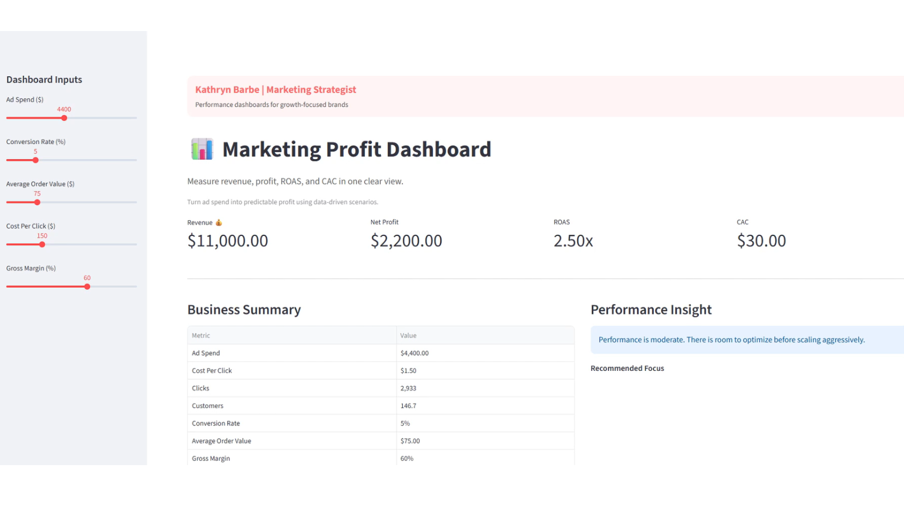

# Marketing Performance Dashboard (Python)

## Key Outcomes

- Delivered a data-driven marketing dashboard to evaluate ROAS, revenue, and campaign efficiency  
- Identified performance gaps and optimization opportunities across channels  
- Enabled more effective budget allocation and strategic decision-making
  
## Overview
Developed a marketing analytics dashboard to track and analyze key performance metrics including revenue, ad spend, and return on ad spend (ROAS).

---

## Objective
Provide a data-driven framework to evaluate marketing performance and identify opportunities to improve profitability and campaign efficiency.

---

## Approach

### Data Analysis
- Analyzed campaign-level performance data including spend, revenue, and conversion metrics
- Identified trends and performance gaps across channels

### Dashboard Development
- Built data visualizations using Python (Pandas, Plotly)
- Created interactive views to monitor performance over time

### Performance Insights
- Identified underperforming campaigns with low ROAS
- Highlighted high-performing segments for scaling
- Supported pricing and budget allocation decisions

---

## Tools Used
- Python (Pandas, Plotly)
- Data visualization techniques
- Marketing performance metrics (ROAS, conversion rate, revenue)

---

## Business Impact
- Improved visibility into marketing performance
- Enabled more efficient allocation of ad spend
- Supported data-driven decision making

---

## Notes
This project reflects practical application of analytics in marketing to drive performance optimization and strategic insights.

## Dashboard Preview

  

